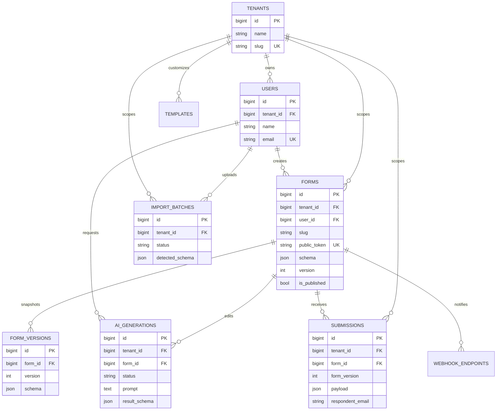

# ER Diagram

```mermaid
erDiagram
    TENANTS ||--o{ USERS : owns
    TENANTS ||--o{ FORMS : scopes
    TENANTS ||--o{ SUBMISSIONS : scopes
    USERS ||--o{ FORMS : creates
    FORMS ||--o{ FORM_VERSIONS : snapshots
    FORMS ||--o{ SUBMISSIONS : receives
    FORMS ||--o{ AI_GENERATIONS : edits
    FORMS ||--o{ WEBHOOK_ENDPOINTS : notifies
    USERS ||--o{ AI_GENERATIONS : requests
    USERS ||--o{ IMPORT_BATCHES : uploads
    TENANTS ||--o{ IMPORT_BATCHES : scopes
    TENANTS ||--o{ TEMPLATES : customizes

    TENANTS {
        bigint id PK
        string name
        string slug UK
    }
    USERS {
        bigint id PK
        bigint tenant_id FK
        string name
        string email UK
    }
    FORMS {
        bigint id PK
        bigint tenant_id FK
        bigint user_id FK
        string slug
        string public_token UK
        json schema
        int version
        bool is_published
    }
    FORM_VERSIONS {
        bigint id PK
        bigint form_id FK
        int version
        json schema
    }
    SUBMISSIONS {
        bigint id PK
        bigint tenant_id FK
        bigint form_id FK
        int form_version
        json payload
        string respondent_email
    }
    AI_GENERATIONS {
        bigint id PK
        bigint tenant_id FK
        bigint form_id FK
        string status
        text prompt
        json result_schema
    }
    IMPORT_BATCHES {
        bigint id PK
        bigint tenant_id FK
        string status
        json detected_schema
    }
```
